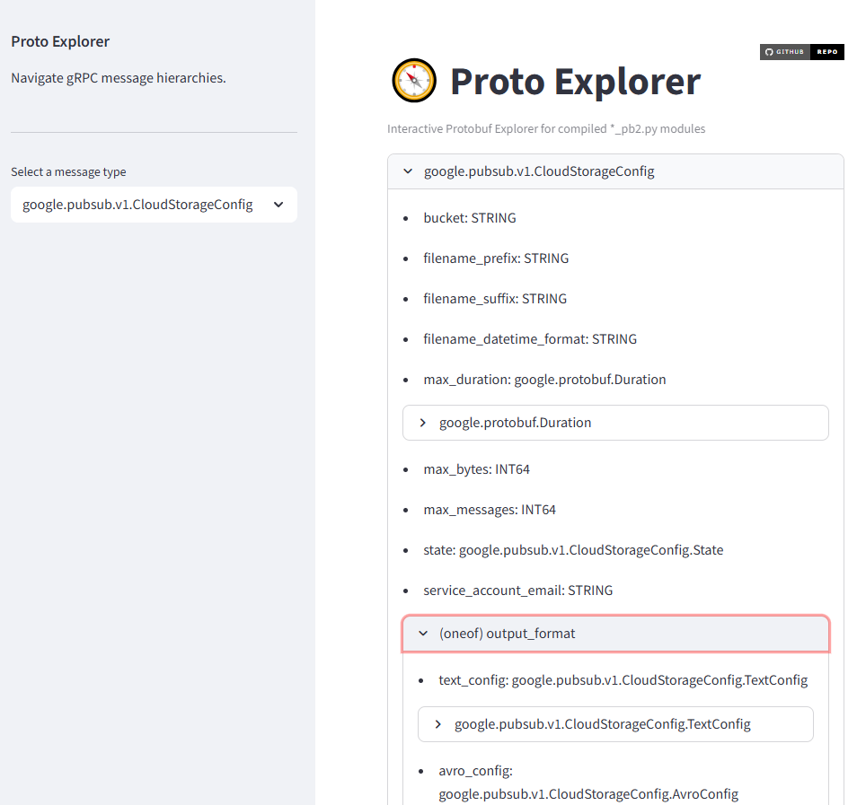

# Proto Explorer
*A lightweight, interactive browser for exploring Protobuf/gRPC hierarchies*

[]()
[](https://streamlit.io/)
[]()

Proto Explorer lets you **visually explore Protobuf message hierarchies** (`*.proto` files) using only the compiled Python files (`*_pb2.py`). No `.proto` files or regeneration required.

✅ Expand nested message fields  
✅ Show `oneof` group hierarchy  
✅ Correctly detect `map<key, value>` fields  
✅ Load `_pb2.py` from custom paths  
✅ No server or DB needed — runs locally  

---

### 🌟 Demo Screenshot

> _Coming soon – add screenshot here once UI finalized_
> You can insert a screenshot like:
>
> 

---

## 🔧 Installation

Clone the repository and install dependencies:
```text
pip install proto-explorer
```
---

## ▶️ Run the App

```bash
proto-explorer -m <compiled_protobuf_pb2_module> [-p </path/to/compiled/protobuf>]
```

## ️✍️ Example:

1. Clone a test Protobuf set (example: Google Pub/Sub):
```bash
git clone https://github.com/googleapis/googleapis.git
cd googleapis
```

2. Compile the .proto files to _pb2.py:
```bash
python -m grpc_tools.protoc \
  --proto_path=. \
  --python_out=. \
  google/pubsub/v1/*.proto \
  google/api/*.proto
```

Confirm that the following _pb2.py file exists:
```bash
google/pubsub/v1/pubsub_pb2.py
```

3. Launch Proto Explorer:
```bash
proto-explorer -m google.pubsub.v1.pubsub_pb2 -p .
```
```text
Launching Proto Explorer...

  You can now view your Streamlit app in your browser.

  Local URL: http://localhost:8501
```
Now open your browser and go to: http://localhost:8501/
Enjoy exploring your Protobuf message hierarchy!
