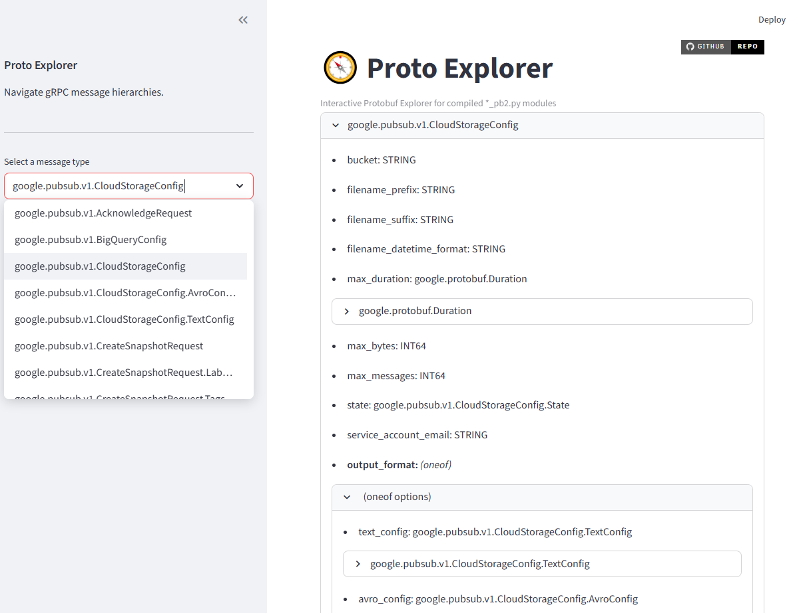

# Proto Explorer
*A lightweight, interactive browser for exploring Protobuf/gRPC hierarchies*

[]()
[](https://streamlit.io/)
[]()

Proto Explorer lets you **visually explore Protobuf message hierarchies** (`*.proto` files) using only the compiled Python files (`*_pb2.py`). No `.proto` files or regeneration required.

✅ Expand nested message fields  
✅ Show `oneof` group hierarchy  
✅ Correctly detect `map<key, value>` fields  
✅ Load `_pb2.py` from custom paths  
✅ No server or DB needed — runs locally  

---

### 🌟 Demo Screenshot

> _Coming soon – add screenshot here once UI finalized_
> You can insert a screenshot like:
>
> 

---

## 🔧 Installation

Clone the repository and install dependencies:
```text
pip install proto-explorer
```
---

## ▶️ Run the App

```text
proto-explorer --proto_module <compiled_protobuf_pb2_module> [--load_path </path/to/compiled/protobuf>]
```

Example:

```text
proto-explorer --proto_module myproject.datamanager.users_pb2 --load_path ~/protos/compiled
```
